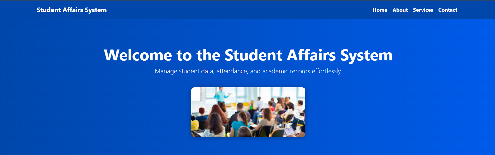
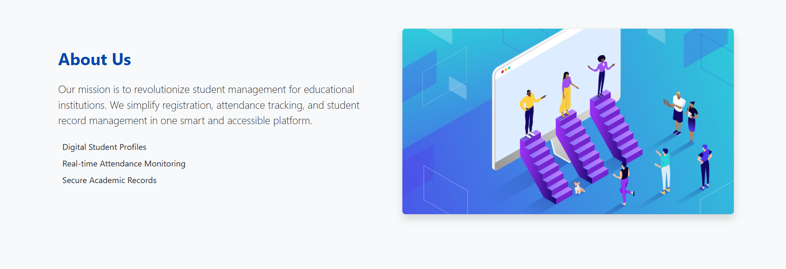
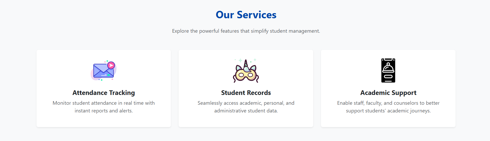
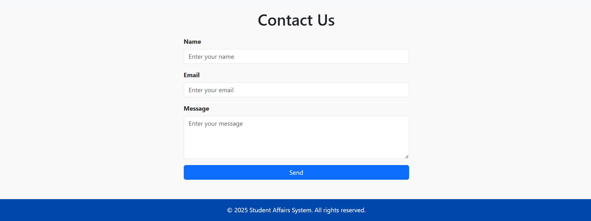

# 🎓 Student Affairs System (Built with HTML, CSS, Bootstrap)

A professional and user-friendly web system designed to streamline educational institution operations. This platform focuses on simplifying the management of student records, tracking attendance, and enhancing academic support — all through an intuitive, responsive interface.

## 🧑‍💻 Tech Stack

### 🔹 HTML5 & CSS3  
Used for building and styling the structure of the web pages.

### 🔹 Bootstrap 5  
Provides responsive design elements and modern UI components for better accessibility and user experience.

---

## 📌 Key Features

- **📅 Real-time Attendance Tracking**  
  Easily monitor, manage, and generate instant reports on student attendance.

- **📁 Student Records Management**  
  View and organize academic, administrative, and personal information for each student.

- **🎯 Academic Support Tools**  
  A set of features to help counselors, faculty, and staff track and support student progress.

1.Home

2.About us

3.Services

4.Contact Us

